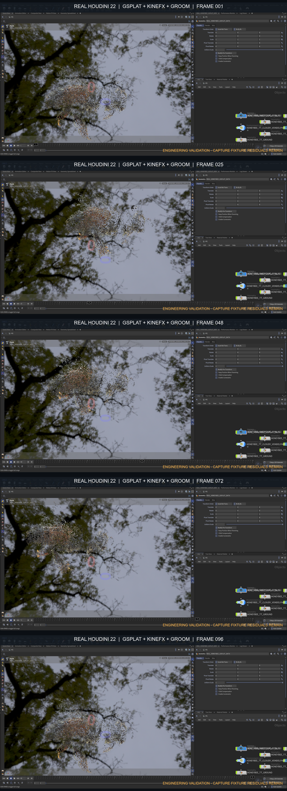

# Houdini GSplat relighting

Prepare an existing Gaussian Splat for interactive relighting, build its USD
lighting stage, and produce a refined Copernicus image without falling back to
raw Python.

## Workflow

1. `inspect_gsplat_relighting_input` validates the source SOP and required
   point attributes.
2. `prepare_gsplat_sop_chain` reconstructs normals and optionally extracts
   albedo with SideFX Labs.
3. `create_gsplat_relight_lop` creates the Solaris relighting node, camera,
   USD lights, dome light, shadows, and shadow-bias controls.
4. `create_gsplat_copernicus_raster` rasterizes from the camera and can append
   resolution, sharpen, HSV, gamma, and premultiplication refinements.

The result is a prepared SOP stream, an editable Solaris lighting stage, and a
camera-matched COP output suitable for near-real-time look development.

Requires Houdini 22 and current SideFX Labs GSplat assets. See
[SKILL.md](SKILL.md) for attribute and execution contracts; `tools.yaml`
contains the callable schemas.

The header is real Houdini output from a licensed multiview reconstruction, not
a concept illustration or SideFX sample. Its source record, reconstruction
metrics, hashes, authored-animation disclosure, and known visual limitations
are documented in
[the showcase provenance](../../../../docs/showcase/honeybee-reference-license.md)
and
[`honeybee-gsplat-validation.json`](../../../../docs/showcase/honeybee-gsplat-validation.json).

For trained-checkpoint ingestion, subject cleanup, dark-anatomy retention, and
animation attribute requirements, see the dedicated contract section in
[SKILL.md](SKILL.md). In particular, public validation must not remove black
eyes or legs with a global brightness mask, and checkpoint-specific image
metrics must remain pending until they are freshly measured.
Fixture/label residuals also fail public beauty acceptance and must be checked
from source-camera projections plus a novel view, not hidden by the HDR or crop.
