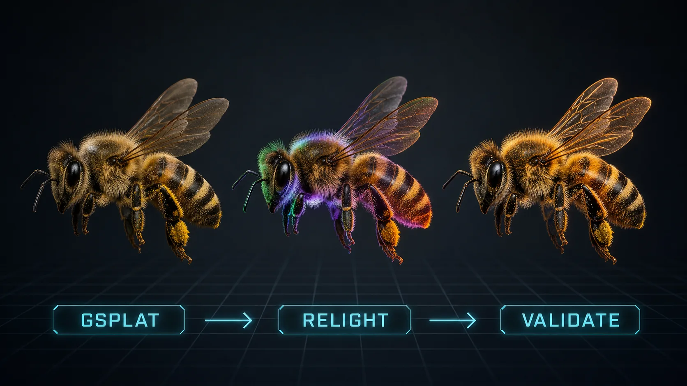

# Houdini GSplat relighting

Prepare an existing Gaussian Splat for interactive relighting, build its USD
lighting stage, and produce a refined Copernicus image without falling back to
raw Python.

## Workflow

1. `inspect_gsplat_relighting_input` validates the source SOP and required
   point attributes.
2. `prepare_gsplat_sop_chain` reconstructs normals and optionally extracts
   albedo with SideFX Labs.
3. `create_gsplat_relight_lop` creates the Solaris relighting node, camera,
   USD lights, dome light, shadows, and shadow-bias controls.
4. `create_gsplat_copernicus_raster` rasterizes from the camera and can append
   resolution, sharpen, HSV, gamma, and premultiplication refinements.

The result is a prepared SOP stream, an editable Solaris lighting stage, and a
camera-matched COP output suitable for near-real-time look development.

Requires Houdini 22 and current SideFX Labs GSplat assets. See
[SKILL.md](SKILL.md) for attribute and execution contracts; `tools.yaml`
contains the callable schemas.

The header image is a workflow illustration, not capture or reconstruction
evidence. A public GSplat showcase must separately provide captured multi-view
provenance, solved camera poses, and live Houdini validation output.
